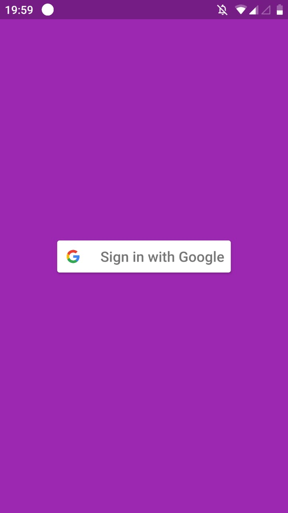
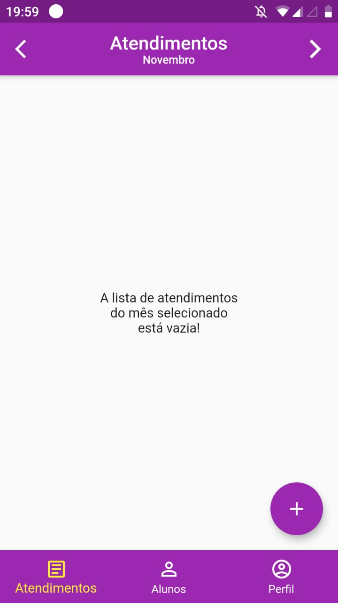
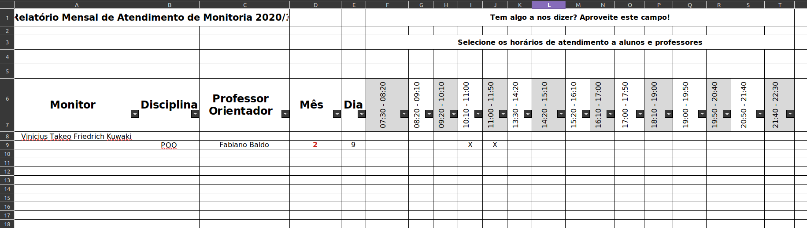

# App Ponto
Ferramentas criadas de forma a facilitar a geração da planilha da monitoria. É composto de duas partes: um aplicativo desenvolvido em Flutter que insere os dados na base (cloudfirestore) e um script em Python que busca os dados da base e os coloca em uma planilha, seguindo o modelo disponibilizado pela diretoria de ensino. Os dados do banco são privados e apenas o admistrador tem acesso. 

## Monitoria_app
Aplicativo em Flutter que insere dados no cloudfirestore. A autenticação do aplicativo é feita utilizando a conta do Google. No aplicativo é possível adicionar alunos e atendimentos realizados durante a monitoria.

### Bibliotecas
- **flutter_launcher_icons**: utilizado para gerar o icone do aplicativo.
- **google_sign_in**: utilizado na autenticação com a conta do Google.
- **firebase_auth**: utilizado para se conectar com o firebase.
- **flutter_auth_buttons**: utilizado para a criação do botão de "conectar com o Google".
- **cloud_firestore**: utilizado para a comunicação com a base de dados.
- **flutter_mobx**: utilizado para gerência de estados.
- **flutter_modular**: utilizado para a modularização das funcionalidades.

### Screenshots

     
  
  
## Gerador
Script em Python que busca da base e os coloca seguindo o modelo disponibilizado pela diretoria de ensino.

### Bibliotecas
- **cloud_firestore**: utilizado para a comunicação com a base de dados.
- **pandas**: utilização de dataframes para manipulação da planilha.
- **openpyxl**: utilizado para manipular com arquivos .xlsx.

### Screenshots

